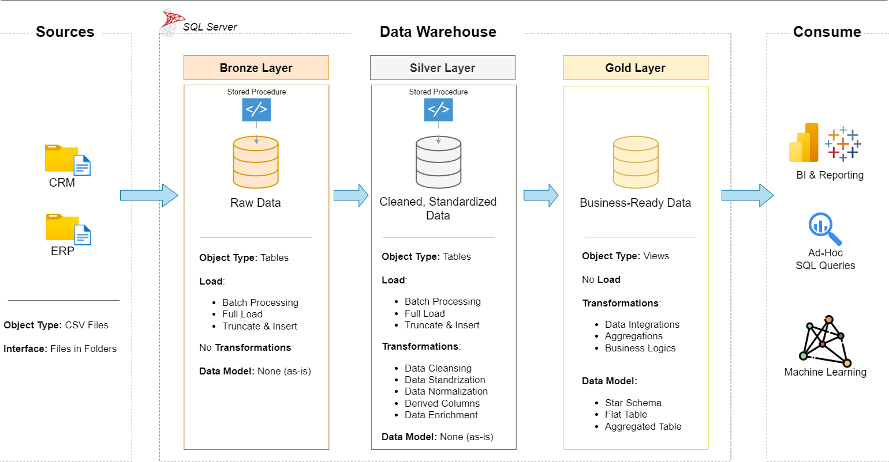

# Projeto de Data Warehouse e Analytics

Bem-vindo ao repositório do **Projeto de Data Warehouse e Analytics**! 🚀  
Este projeto demonstra uma solução abrangente de data warehousing e analytics, desde a construção de um data warehouse até a geração de insights acionáveis. Projetado como um projeto de portfólio, ele destaca as melhores práticas da indústria em engenharia de dados e analytics.

---
## 🏗️ Arquitetura de Dados

A arquitetura de dados para este projeto segue as camadas **Bronze**, **Silver** e **Gold** da Arquitetura Medallion:

1. **Camada Bronze**: Armazena dados brutos exatamente como vêm dos sistemas de origem. Os dados são ingeridos de arquivos CSV para um Banco de Dados SQL Server.
2. **Camada Silver**: Esta camada inclui processos de limpeza, padronização e normalização de dados para prepará-los para análise.
3. **Camada Gold**: Abriga os dados prontos para o negócio, modelados em um *star schema* (esquema estrela) necessário para relatórios e analytics.

---
## 📖 Visão Geral do Projeto

Este projeto envolve:

1. **Arquitetura de Dados**: Design de um Data Warehouse Moderno usando as camadas **Bronze**, **Silver** e **Gold** da Arquitetura Medallion.
2. **Pipelines de ETL**: Extração, transformação e carga (ETL) de dados dos sistemas de origem para o data warehouse.
3. **Modelagem de Dados**: Desenvolvimento de tabelas fato e dimensão otimizadas para consultas analíticas.
4. **Analytics e Relatórios**: Criação de relatórios baseados em SQL e dashboards para insights acionáveis.

🎯 Este repositório é um excelente recurso para profissionais e estudantes que desejam demonstrar experiência em:
- Desenvolvimento SQL
- Arquitetura de Dados
- Engenharia de Dados  
- Desenvolvimento de Pipelines ETL  
- Modelagem de Dados  
- Análise de Dados (Data Analytics)

---

## 🛠️ Links e Ferramentas Importantes:

Tudo é gratuito!
- **[Datasets](datasets/):** Acesso ao conjunto de dados do projeto (arquivos csv).
- **[SQL Server Express](https://www.microsoft.com/en-us/sql-server/sql-server-downloads):** Servidor leve para hospedar seu banco de dados SQL.
- **[SQL Server Management Studio (SSMS)](https://learn.microsoft.com/en-us/sql/ssms/download-sql-server-management-studio-ssms?view=sql-server-ver16):** Interface gráfica (GUI) para gerenciar e interagir com bancos de dados.
- **[Git Repository](https://github.com/):** Configure uma conta e um repositório no GitHub para gerenciar, versionar e colaborar com seu código de forma eficiente.
- **[DrawIO](https://www.drawio.com/):** Projete a arquitetura de dados, modelos, fluxos e diagramas.
- **[Notion](https://www.notion.com/):** Ferramenta completa (All-in-one) para gestão e organização de projetos.

---

## 🚀 Requisitos do Projeto

### Construindo o Data Warehouse (Engenharia de Dados)

#### Objetivo
Desenvolver um data warehouse moderno usando SQL Server para consolidar dados de vendas, permitindo relatórios analíticos e tomadas de decisão informadas.

#### Especificações
- **Fontes de Dados**: Importar dados de dois sistemas de origem (ERP e CRM) fornecidos como arquivos CSV.
- **Qualidade de Dados**: Limpar e resolver problemas de qualidade de dados antes da análise.
- **Integração**: Combinar ambas as fontes em um modelo de dados único e amigável, projetado para consultas analíticas.
- **Escopo**: Focar apenas no conjunto de dados mais recente; não é necessário o histórico (historization) dos dados.
- **Documentação**: Fornecer documentação clara do modelo de dados para apoiar tanto os stakeholders de negócios quanto as equipes de analytics.

---

### BI: Analytics e Relatórios (Análise de Dados)

#### Objetivo
Desenvolver análises baseadas em SQL para fornecer insights detalhados sobre:
- **Comportamento do Cliente**
- **Desempenho do Produto**
- **Tendências de Vendas**

Esses insights capacitam os stakeholders com métricas de negócios fundamentais, permitindo tomadas de decisão estratégicas.  

Para mais detalhes, consulte [docs/requirements.md](docs/requirements.md).

## 📂 Estrutura do Repositório
